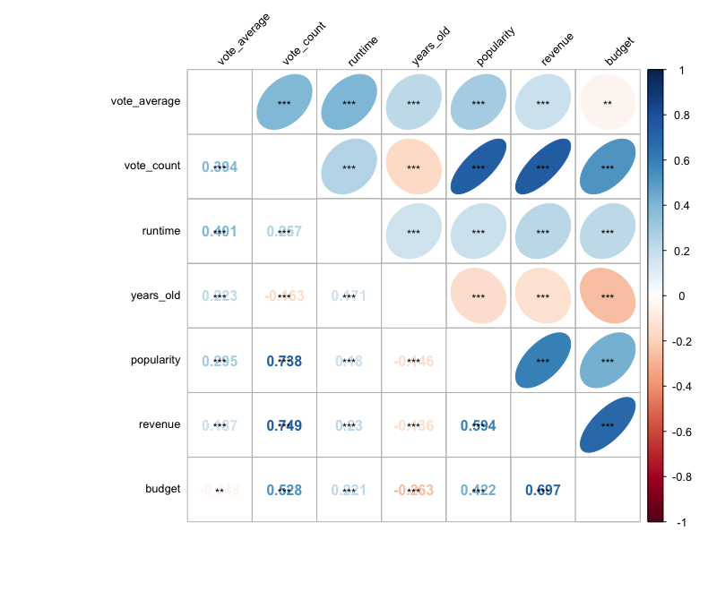
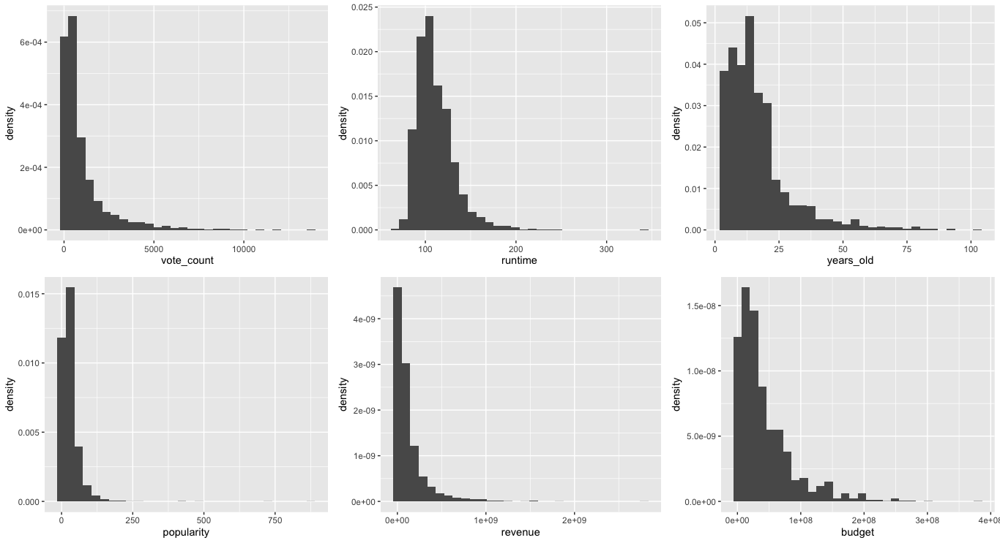
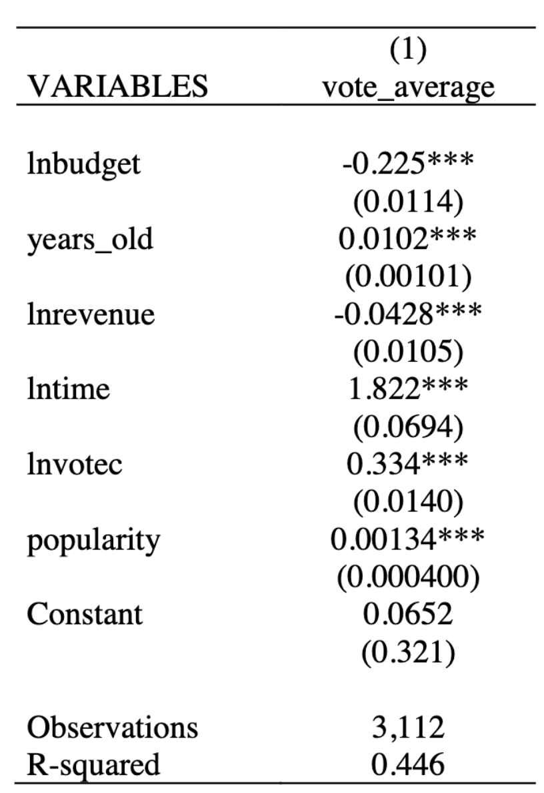
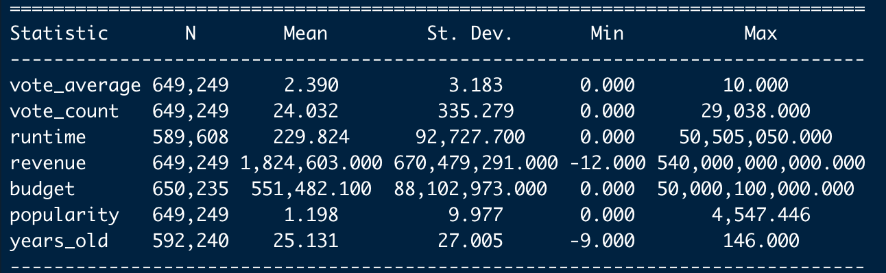
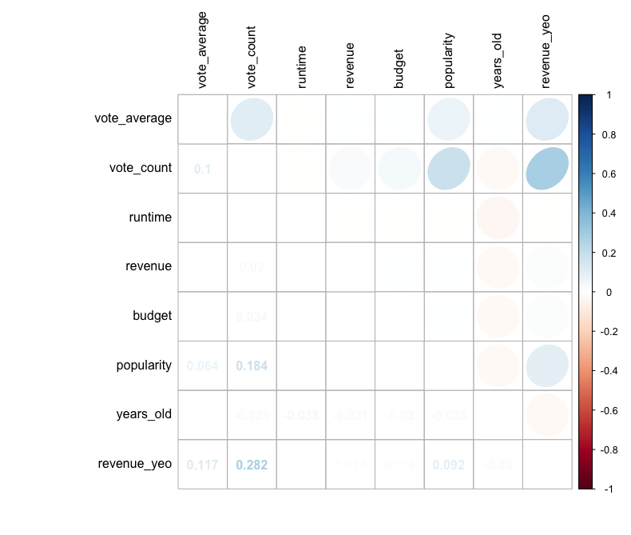
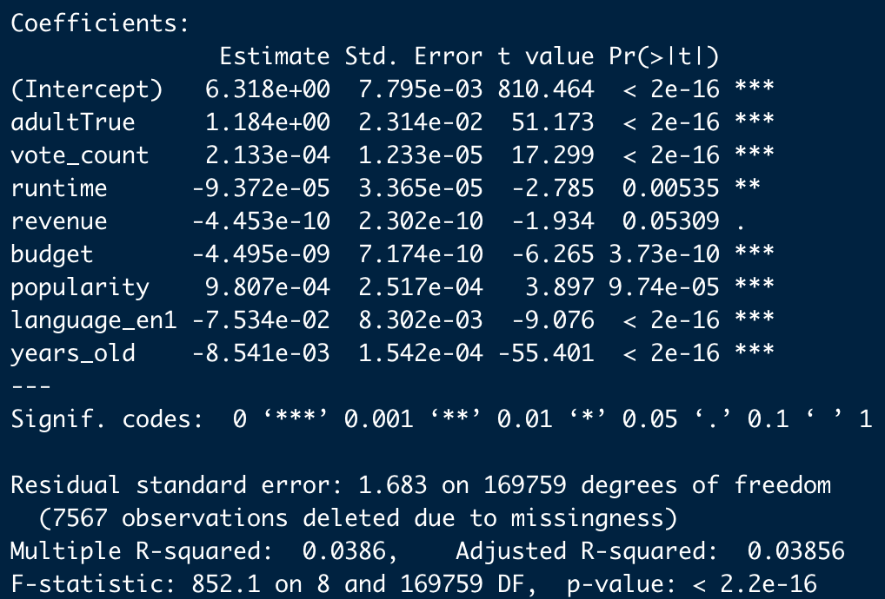
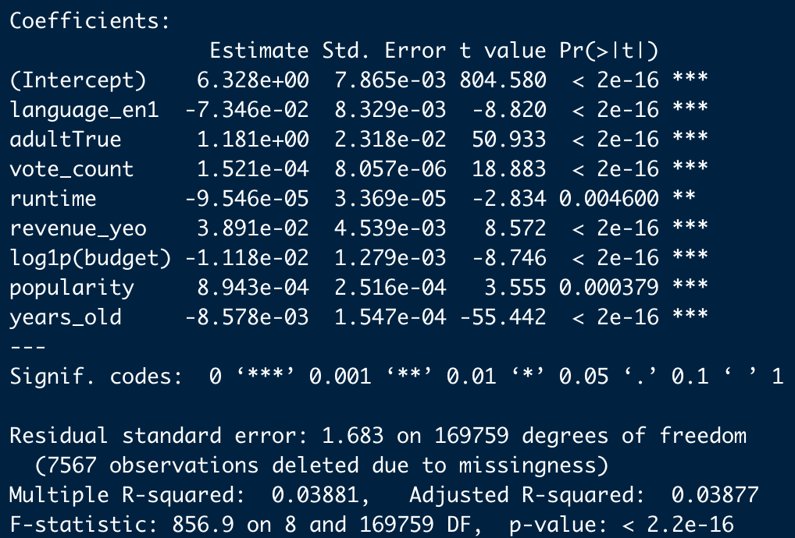

```{r setup, include=FALSE}
knitr::opts_chunk$set(echo = FALSE)
```

## Main purpose

- Reproduce old project
- Check consistency of findings on a new dataset
- Use version control to make the project reproducible


## Reproduce old project

- new software (R vs. Stata)
- lack of documentation about data preparation -> we tried to rely on report but information attached was too vague
- not able to reproduce the exact results


## Data preparation

- originaly performed in Excel
- this time we focused on obtaining the same data rather than on reasonable decisions


## Preparation based on report description...

...did not result in the same outcome

Old:
```{r, echo = F, warning=FALSE, message=FALSE, fig.align = "center", out.height= "200px", out.width="450px"}
library(rmarkdown)
knitr::include_graphics("img/statistics_table.jpg")  
```

Reproduced:
```{r, echo = F, warning=FALSE, message=FALSE, fig.align = "center", out.height= "160px", out.width="450px"}

knitr::include_graphics("img/statistics_table_new1.jpg")  

```


## Trimming values to the range from old project


Old:
```{r, echo = F, warning=FALSE, message=FALSE, fig.align = "center", out.height= "200px", out.width="450px"}

knitr::include_graphics("img/statistics_table.jpg")  
```

Reproduced:
```{r, echo = F, warning=FALSE, message=FALSE, fig.align = "center", out.height= "160px", out.width="450px"}

knitr::include_graphics("img/statistics_table_new2.jpg")  

```


## Some differences
Old:
```{r, echo = F, warning=FALSE, message=FALSE, fig.align = "center", out.height= "220px", out.width="420px"}

knitr::include_graphics("img/hist_old.jpg")  

```
Reproduced:
```{r, echo = F, warning=FALSE, message=FALSE, fig.align = "center", out.height= "220px", out.width="420px"}

library(ggplot2)
library(ggthemes)

load(file = "data/movies_old_cleaned.rda") 

ggplot(data = movies_old, aes(x = vote_average)) +
  geom_histogram(aes(y = ..density..)) +
  stat_function(fun = dnorm,
                color = 'red',
                size = 1,
                args = list(mean = mean(movies_old$vote_average), sd(movies_old$vote_average))) + theme_stata()
```

## Reproduced data variables correlation

```{r, echo = F, warning=FALSE, message=FALSE, fig.align = "left", out.height= "500px", out.width="800px"}

  


```

## Reproduced data variables histograms

```{r, echo = F, warning=FALSE, message=FALSE, fig.align = "left", out.height= "500px", out.width="950px"}

  

```


## Results

Old R² = 0.446

Reproduced R² = 0.44

## Old model summary

```{r, echo = F, warning=FALSE, message=FALSE, fig.align = "center", out.height= "400px", out.width="300px"}

  

```

## Reproduced model summary
```{r, echo = F, warning=FALSE, message=FALSE, fig.align = "center", out.height= "200px", out.width="550px"}

variables_names <- c('(Intercept)','budget_ln','years_old','years_old_squared',
                     'revenue_ln','runtime_ln','vote_count_ln','popularity')

est_rep <- c(-0.51, -0.25, 0.05, -0.00, -0.06, 1.91, 0.41, 0.00)
S.E_rep <- c(0.39, 0.01, 0.01, 0.00, 0.01, 0.08, 0.02, 0.00)
t_val_rep <- c(-1.32, -17.67, 5.13, -3.21, -4.18, 22.80, 22.28, 2.65)
p_rep <- c(0.19, 0.00, 0.00, 0.00, 0.00, 0.00, 0.00, 0.01)

Reproduced_model_summary_table <- data.frame(variables_names,est_rep,S.E_rep,
                                             t_val_rep, p_rep)

Reproduced_model_summary_table
```


## Results - other conclusions
- quite similar at first glance
- passed RESET specification test originally
- failed RESET specification test at 5% of significance level
- error isn't normally distributed (previously it probably was)

## Project based on a new dataset
- large dataset from the Kaggle platform containing 650 234 movies and TV shows
- applying exact same  methods used in the reproduced project

```{r, echo = F, warning=FALSE, message=FALSE, fig.align = "center", out.height= "200px", out.width="550px"}

  
```

## Data preparation
- We removed 6827 rows (around 1% of the data) with the NA values in the vote_average column
- We removed all the rows with vote_average lower than 1
  - TMDb has rating scale 1-10, so we expect that every value below 1 comes from NA values

## Dependent variable density

```{r, echo = F, warning=FALSE, message=FALSE, fig.align = "center", out.height= "450px", out.width="900px"}

new_movies_train <- readRDS(file = "data/new_movies_train.rda") 

ggplot(data = new_movies_train, aes(x = vote_average)) +
  geom_histogram(aes(y = ..density..)) +
  stat_function(fun = dnorm,
                color = 'red',
                size = 1,
                args = list(mean = mean(new_movies_train$vote_average), sd(new_movies_train$vote_average))) + theme_stata()
```

## New dataset variables correlations

- We can see the strong correlation between budget and revenue, but also between vote_count and revenue and budget
```{r, echo = F, warning=FALSE, message=FALSE, fig.align = "left", out.height= "450px", out.width="800px"}

  

```

## Modelling

- Estimation of the model with all variables
- Revenue is not significant on 5% level of significance. We've seen that it is strongly skewed.
  - It may have zero or negative values so we'll transform it with yeo-johnson transformation

```{r, echo = F, warning=FALSE, message=FALSE, fig.align = "left", out.height= "300px", out.width="600px"}

  

```

## Final model

- We added transformation of budget with natural logarithm
- There is hardly any difference in R² but revenue_yeo is significant now.

```{r, echo = F, warning=FALSE, message=FALSE, fig.align = "left", out.height= "400px", out.width="700px"}

  

```

## Results
- Results on the test dataset: 

MSE = 2.83, RMSE = 1.68, MAE = 1.26, 

MedAE = 0.93, MSLE = 0.08, R² = 0.124

- R² a lot higher with prediction on the test dataset

## Additional thoughts

- The dependent variable is continuous, but it comes frome the likert scale, which 
is the ordinal measurement scale
  - It may cause problem, because we treat the target variable as a continuous,
  but people can not vote in such way
  - According to the market analyzes, people are more likely to choose the upper
  half of the scale, so the average vote is not a 5, bot more likely 6 or 7
- There is no one specific way to deal with such data across the literature

